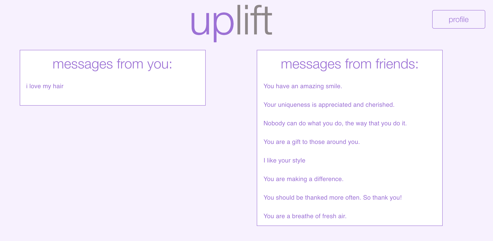

# Uplift

Built for Same Home Different Hacks hackathon (MLH, Devpost).
https://devpost.com/software/uplift-f1jie3

## Team

Anna Lulushi - [alulushi1026](https://github.com/alulushi1026)

Jeff Li - [voidJeff](https://github.com/voidJeff)

[Sean Prendi](https://www.seanprendi.me/#/) - [seanprendi](https://github.com/seanprendi)

[JJ Cheng](https://jjcheng.me) - [jchengjr77](https://github.com/jchengjr77)

## Intro

Uplift is a support platform designed to encourage and showcase you and your friends. Write something nice about yourself and one other person every day.

The Ultimate Self Love Platform.

## Tech Stack

Frontend: React

Backend: Node.js (express)

Database: Firebase

Deployment: Google Cloud (Firebase)

## Endpoints

GET request for profile:
`GET /profile?uid=123`

GET request for random friend:
`GET /random-friend?self_id=123`

GET request for random other_message:
`GET/random-message?self_id=123`

POST request for self-messages:
`POST /to-self/$self_id {message}`

POST request for other-messages:
`POST /to/$uid {message}`

POST request for adding a friend:
`POST /add-friend/$self_uid {friend_email}`

POST request for removing a friend:
`POST /remove-friend/$self_uid/$friend_uid`

POST request for creating new user:
`POST /new-user {username, email, uid}`

## Key Colors

Off-White:  `#F8F1FF`

Purple:  `#A46DDB`

Gray:  `#908789`

Lavender:  `#B8A7CA`

## Design

